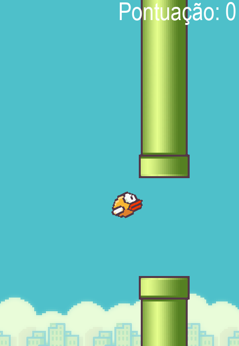

# Clone do jogo flappyBird 🐦

### Tecnologias ultilizada:

### Imagem de apresentação do projeto:

O Objetivo do jogo é passar pelos canos sem encostar [`Use a tecla [ Space ] para isso`].

## Informações de contato:

  
